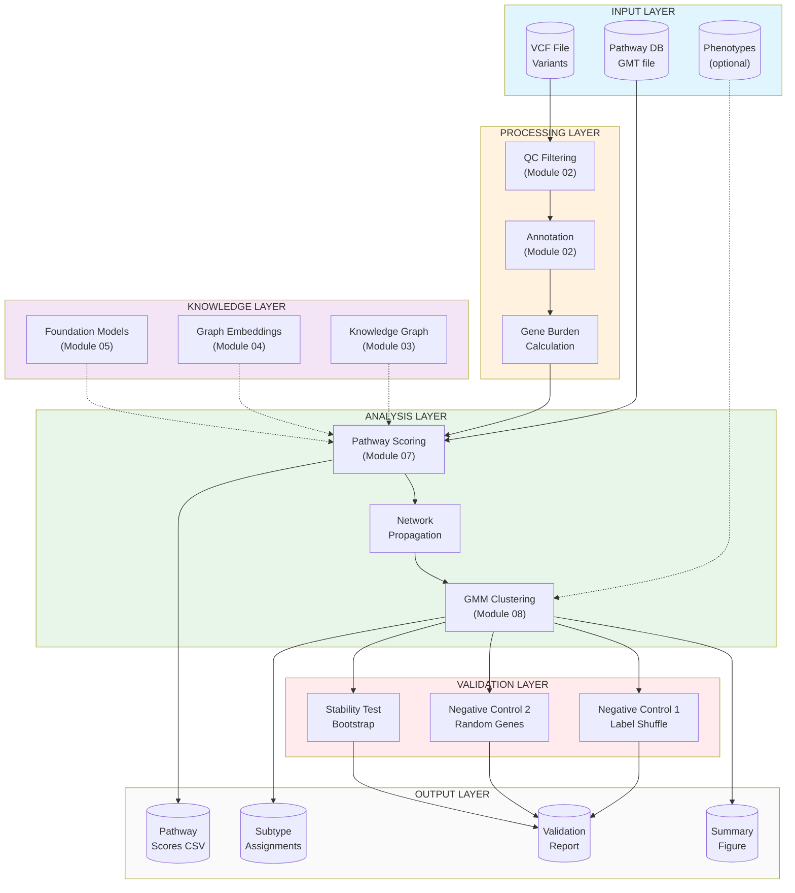

# Pipeline Architecture Diagram

> **RESEARCH USE ONLY** — This framework is for research purposes only.

## Overview

The Autism Pathway Framework implements a **layered hybrid architecture** that transforms genetic variants into biologically interpretable subtypes.

---

## Pipeline Flow Diagram



---

## Simplified ASCII Diagram

For environments without Mermaid rendering:

```
┌─────────────────────────────────────────────────────────────────────┐
│                          INPUT LAYER                                 │
│   ┌──────────┐    ┌──────────────┐    ┌──────────────┐              │
│   │ VCF File │    │ Phenotypes   │    │ Pathway DB   │              │
│   │ Variants │    │  (optional)  │    │  (GMT file)  │              │
│   └────┬─────┘    └──────┬───────┘    └──────┬───────┘              │
└────────┼─────────────────┼───────────────────┼──────────────────────┘
         │                 │                   │
         ▼                 │                   │
┌─────────────────────────────────────────────────────────────────────┐
│                      PROCESSING LAYER                                │
│   ┌──────────┐    ┌──────────┐    ┌──────────────┐                  │
│   │    QC    │───▶│ Annotate │───▶│ Gene Burden  │                  │
│   │ Filtering│    │          │    │ Calculation  │                  │
│   └──────────┘    └──────────┘    └──────┬───────┘                  │
└──────────────────────────────────────────┼──────────────────────────┘
                                           │
         ┌─────────────────────────────────┼──────────────────┐
         │        KNOWLEDGE LAYER          │                  │
         │  ┌────────────┐ ┌───────────┐   │ ┌─────────────┐  │
         │  │ Knowledge  │ │   Graph   │   │ │ Foundation  │  │
         │  │   Graph    │ │ Embeddings│   │ │   Models    │  │
         │  └─────┬──────┘ └─────┬─────┘   │ └──────┬──────┘  │
         └────────┼──────────────┼─────────┼────────┼─────────┘
                  │              │         │        │
                  └──────────────┴────┬────┴────────┘
                                      │ (optional enrichment)
                                      ▼
┌─────────────────────────────────────────────────────────────────────┐
│                        ANALYSIS LAYER                                │
│   ┌──────────────┐    ┌────────────────┐    ┌────────────────┐      │
│   │   Pathway    │───▶│    Network     │───▶│  GMM Clustering│      │
│   │   Scoring    │    │  Propagation   │    │   (Subtypes)   │      │
│   └──────────────┘    └────────────────┘    └───────┬────────┘      │
└─────────────────────────────────────────────────────┼───────────────┘
                                                      │
                                                      ▼
┌─────────────────────────────────────────────────────────────────────┐
│                       VALIDATION LAYER                               │
│   ┌────────────────┐  ┌────────────────┐  ┌────────────────┐        │
│   │ Neg Control 1  │  │ Neg Control 2  │  │ Stability Test │        │
│   │ Label Shuffle  │  │ Random Genes   │  │   Bootstrap    │        │
│   └───────┬────────┘  └───────┬────────┘  └───────┬────────┘        │
└───────────┼───────────────────┼───────────────────┼─────────────────┘
            │                   │                   │
            └───────────────────┼───────────────────┘
                                ▼
┌─────────────────────────────────────────────────────────────────────┐
│                         OUTPUT LAYER                                 │
│   ┌──────────────┐  ┌──────────────┐  ┌────────┐  ┌────────────┐    │
│   │   Pathway    │  │   Subtype    │  │ Report │  │  Summary   │    │
│   │  Scores CSV  │  │ Assignments  │  │ JSON/MD│  │   Figure   │    │
│   └──────────────┘  └──────────────┘  └────────┘  └────────────┘    │
└─────────────────────────────────────────────────────────────────────┘
```

---

## Module Mapping

| Layer | Modules | Description |
|-------|---------|-------------|
| **Input** | - | VCF, phenotypes, pathway database |
| **Processing** | 01, 02 | Data loading, QC, annotation, gene burden |
| **Knowledge** | 03, 04, 05 | Knowledge graph, embeddings, foundation models |
| **Analysis** | 06, 07, 08 | GNN, pathway scoring, clustering |
| **Validation** | - | Negative controls, stability testing |
| **Output** | - | CSV tables, reports, figures |

---

## Data Flow Summary

```
Variants (VCF)
    │
    ▼
Gene-level burden scores (per sample × gene)
    │
    ▼
Pathway disruption scores (per sample × pathway)
    │
    ▼
Clustered subtypes (per sample → cluster assignment)
    │
    ▼
Validated outputs (with reproducibility checks)
```

---

## Key Design Principles

1. **Layered Architecture**: Each layer has well-defined inputs/outputs
2. **Modularity**: Components can be used independently or combined
3. **Validation-First**: Built-in negative controls and stability testing
4. **Reproducibility**: Deterministic with seed control and hash verification
5. **Research-Only**: Clear boundaries on appropriate use

---

*See [framework_overview.md](framework_overview.md) for conceptual details.*
